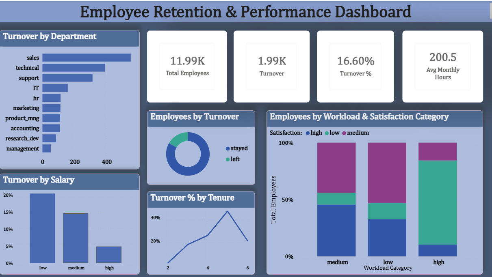

# Employee Retention & Performance Analysis

Analyzing why employees leave — and what the business can do about it — using a real-world HR dataset of 11,991 employees. This project covers the full workflow: cleaning raw data, building an interactive dashboard, and translating the findings into a plain-language report for non-technical stakeholders.

## Overview

Employee turnover was sitting at **16.6%** — roughly 1 in 6 employees leaving. This project digs into *why*, using satisfaction scores, workload, pay tier, tenure, and department data to find the patterns behind who leaves and when.

## Data

- **Source:** HR employee records (satisfaction level, performance evaluation, project count, monthly hours, tenure, department, salary tier, and attrition status)
- **Size:** 11,991 employees after cleaning
- **Process:** Raw data was cleaned and enriched with derived categories (satisfaction category, workload category) to support the dashboard and analysis

## Key Findings

- **Workload is the strongest predictor of turnover** — overloaded employees leave 53% of the time vs. 10% for those with a balanced workload
- **Pay is a major driver** — employees on the lowest salary tier leave 4x more often than those on the highest tier
- **~720 employees are both overloaded and unhappy** — the highest-risk group for imminent turnover
- **Turnover peaks at the 5-year mark** (45%) and nearly disappears after year 6, pointing to a critical retention window
- **HR has the highest departmental turnover**; Management and R&D are the most stable

## Dashboard

An interactive dashboard visualizes turnover by department, salary, tenure, and workload/satisfaction combinations, alongside top-line KPIs (headcount, turnover %, average monthly hours).


## Business Report

A separate stakeholder-facing report translates the analysis into plain, non-technical language — leading with the headline finding and a clear recommendation, following the BLUF (Bottom Line Up Front) format standard in analytics reporting.

## Tools Used

- Excel / Spreadsheet analysis (data cleaning, pivot tables, categorization)
- Dashboard visualization
- Business insight reporting

## Repo Structure

```
├── analysis            # Raw analytics work
├── data/               # Raw and cleaned datasets
├── dashboard/          # Dashboard file
├── report/             # Business insight report (stakeholder-facing)
└── README.md
```

## Why This Project

Most retention analyses stop at "here's the data." This project goes a step further — translating findings into recommendations a non-technical stakeholder can act on immediately, which is the actual job of a data analyst in most companies.
